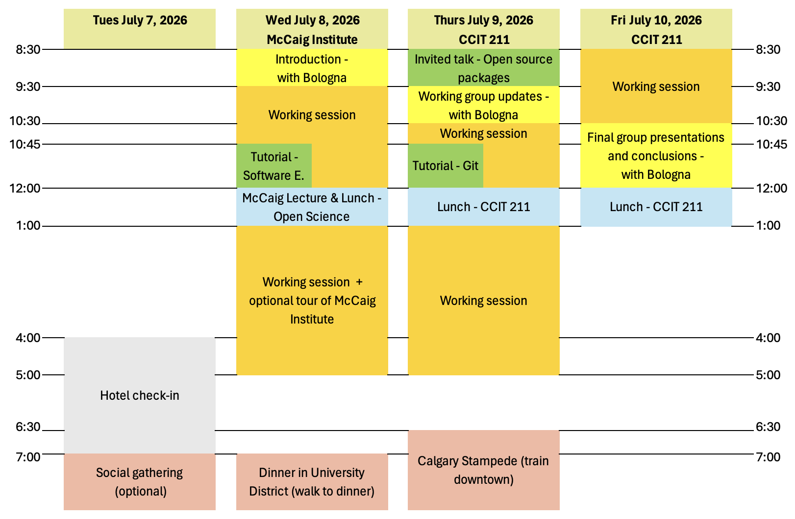
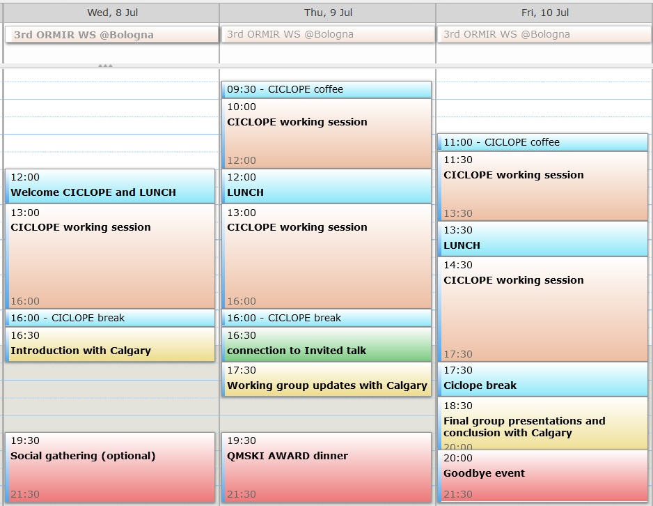

# Best Software Engineering Practices in Musculoskeletal Imaging Research
## 3rd workshop of the [Open and Reproducible Musculoskeletal Imaging Research (ORMIR) Community](https://ormircommunity.github.io/)
Main financial support by Canadian Institutes for Health Research, Planning and Dissemination Grant  
Financial support for Distinguished Speaker: McCaig Institute for Bone and Joint Health
<!--Sponsors: xxx-->
  

Dates: July 8-10, 2026

Venues in Calgary (Canada): 
- [McCaig Institute for Bone and Joint Health](https://maps.app.goo.gl/R5P92f7S9x34CP4x8), Foothills Medical Campus
- [CCIT building](https://maps.app.goo.gl/tt66XgKmeWpHSFh98), University of Calgary

Venue in Bologna (Italy):
- IRCCS Istituto Ortopedico Rizzoli

---

Previous ORMIR workshops: 
- [2nd ORMIR Workshop: Sharing and Curating Open Data in Musculoskeletal Imaging Research](https://github.com/ORMIRcommunity/2024_2nd_ORMIR_WS/blob/main/README.md), January 15-18, 2024, Zurich (Switzerland)
- [1st ORMIR Workshop: Building the Jupyter Community in MSK Imaging Research](https://github.com/JCMSK/2022_JCW/blob/main/README.md), June 9-11, 2022, Maastricht (The Netherlands)

---

In this page, you will find: 

- [Program](#Program)
  - [Working groups](#working-groups)
  - [Invited speakers](#invited-speakers)
  <!-- - [Hackathons](#hackathons), [Tutorials](#tutorials), , [Walk/hike](#walkhike), [Other material](#other-material)   --> 
- [Participants](#participants)  
- [Staying, eating, and travelling](#stayingeatingtravelling)    
  - [Accommodation](#accommodation), [Meals](#meals), [Public transportation](#public-transportation), [Travel reimbursements](#travel-reimbursements)  
<!--
- [More](#more)   
  - [Accepted proposal](#accepted-proposal), [Final report](#final-report), [Final budget](#final-budget), [Photos](#photos) 
-->

<!--
- [Tips](#tips)   
  - [What you need to know about Switzerland](#What-you-need-to-know-about-the-Switzerland), [Practical information about Zurich](#Practical-information-about-Zurich), [Things to do or see in Zurich](#Things-to-do-or-see-in-Zurich)   -->

---

## Program

In Calgary:

  

<!--
-->

In Bologna:
  

### Working groups

*Feel free to contact the coordinators if you need any help!*

In Calgary:
- **ORMIR-XCT code**
  - Aim: To extend the functionalities of ORMIR-XCT
  - Working guidelines [coming soon!]()
  - GitHub repository [here](https://github.com/ORMIR-XCT/ORMIR-XCT)
  - Coordinator: [Michael Kuczynski](https://www.linkedin.com/in/mkuczyns/)  
- **ORMIR-XCT documentation**
  - Aim: To populate the ORMIR-XCT website with information for developers and users
  - Working guidelines: for the content [here](https://docs.google.com/document/d/1rE0JOtLHnwMk7ywklSXp8AEGM22bPKR26o392kj_fhU/edit?usp=sharing) and for the computational tools [here](https://www.ormir.org/code_guidelines/docs-contributing/)
  - GitHub repository [here](https://github.com/ORMIR-XCT/ormir-xct.github.io)
  - Website [here](https://ormir-xct.github.io/)
  - Coordinator: [Serena Bonaretti](https://sbonaretti.github.io/)
- **Integration ORMIR-MIDS and ORMIR-XCT**
  - Aim: To integrate the file and folder structure or ORMIR-MIDS in the ORMIR-XCT functionalities and workflows
  - Working guidelines [here](https://docs.google.com/document/d/1cOuzd0ZXzHeT-GA3ThzqJn9iv8D7M348xsDEDv5bNqk/edit?usp=sharing)
  - GitHub repository [here](https://github.com/ormir-mids/ormir-mids)
  - Coordinator: [Francesco Santini](https://www.francescosantini.com/)

In Bologna:
- **Ciclope**
  - Aim: To extend the functionalities of Ciclope
  - Working guidelines [here](https://docs.google.com/document/d/1tezdPCSCIN0VacOfaYaZtvHsdq-mwjzGhy_SXKYMhCc/edit?usp=sharing)
  - GitHub repository [here](https://github.com/ciclope-microFE/ciclope)
  - Coordinator: [Enrico Schileo](http://www.ior.it/en/ricerca-e-innovazione/enrico-schileo-msc-phd)

<!--
- **Metadata standardization for (MSK)BIDS (now ORMIR-MIDS)** 
  - Group presentation: [here](./presentations/ormir_mids.pdf)
  - GitHub repository: [ORMIR-MIDS](https://github.com/ormir-mids)
  - Coordinators: *Gianluca Iori* and *Donnie Cameron*
- **Guidelines for data sharing** 
  - GitHub repository: [ORMIR data guidelines](https://github.com/ORMIRcommunity/ormir_index_guidelines)
  - Documentation: [document](https://docs.google.com/document/d/1zlM3jXVO-tIVCum4jvh4jGhMstlhguBCqHR1yd-3cm8/edit?usp=sharing) and [spreadsheet](./presentations/Group1-DataSharing-ConsensusMetaDataList-Final.xlsx)
  - Coordinator: *Sarah Manske*
- **Biomechanics** 
  - Group presentation: [here](./presentations/biomechanics.pdf)
  - GitHub repository: [HipPyFemur](https://github.com/hippyfemur)
  - Coordinator: *Lorenzo Grassi*
- **Data format converters (ScancoIO)**
  - GitHub repository: [vtkbone](https://github.com/OpenMSKImaging/vtkbone/tree/master/Tutorials)
  - Coordinator: *Matthias Walle*
-->

### Invited speakers
- [Christof Seiler](https://christofseiler.github.io/) (tutorial). Topic: Introduction to software engineering principles
- [Erica Baldesarra](https://www.linkedin.com/in/erica-baldesarra-68966123a/) (tutorial). Topic: Working with Git
- [Matt McCormick](https://www.linkedin.com/in/drmatthewmccormick/) (presentation; virtual). Topic: best practices in maintaining and contributing to open source packages - lessons learned from real life
- [Serena Bonaretti](https://sbonaretti.github.io/) (presentation). Topic: The importance of open science  

*Note*: It will be possible to join presentations and tutorials remotely. They will also be recorder and added to the [ORMIR YouTube channel](https://www.youtube.com/@ormircommunity)

<!--
- [Ricard Martínez (University of Valencia)](https://www.uv.es/uvweb/college/en/profile-1285950309813.html?p2=martiner&idA=) - *Data Sharing for the CHAIMELEON project* ([video](https://www.youtube.com/watch?v=j1HripU7Ubg))
- [Tim Smith (CERN)](https://tjs.web.cern.ch/tjs/index.html) - *Open is not enough* ([video](https://www.youtube.com/watch?v=PhcpiC5pAhg))
- [Katrin Crameri (Swiss Institute of Bioinformatics)](https://www.linkedin.com/in/katrin-crameri-phd-mph-673741197/) and [Patrick Hirschi (University Hospital Zurich)](https://patrick-hirschi.ch/) - *The SPHN data-enabling framework: From routinely collected healthcare to FAIR research data* ([video](https://www.youtube.com/watch?v=Z52qLfSv6s8))
<!-- 
The presentation by **Ricard Martínez** will be **remote** only. The presentations by **Tim Smith** and **Katrin Crameri with Patrick Hirschi** will be **hybrid**.  
- To attend the presentations *remotely*, register [here](https://www.eventbrite.co.uk/e/sharing-and-curating-open-data-in-musculoskeletal-imaging-research-tickets-790119648137) (if the link does not work, copy/paste this link in your browser: https://www.eventbrite.co.uk/e/sharing-and-curating-open-data-in-musculoskeletal-imaging-research-tickets-790119648137)
- To attend the presentations *in person*, join us in the Auditorium of Schulthess Klinic on Tuesday (Lengghalde 2, 8008 Zürich) and in the Auditorium of Balgrist University Hospital on Wednesday (Forchstrasse 340, 8008 Zürich) -->

---

## Participants
In Calgary:

- Abhimanyu Mertiya
- [Andrew Burghardt](https://profiles.ucsf.edu/andrew.burghardt)
- [Bettina Willie](https://github.com/BWillieLab)
- [Callie Stirling](https://www.linkedin.com/in/callie-stirling-16ces2/)
- [Cecilia Liberati](https://www.linkedin.com/in/cecilia-liberati/)
- Cecily Chen
- [Danielle Whittier](https://www.linkedin.com/in/daniellewhittier/)
- [Elena Paravisi](https://www.linkedin.com/in/elena-paravisi2/)
- Erica Baldesarra
- [Francesco Santini](https://www.francescosantini.com/)
- [Johannes Bereiter-Payr](https://johannespayr.eu/)
- Justen Saini
- Kandrix Kim
- [Kathryn Stok](https://findanexpert.unimelb.edu.au/profile/778607-kathryn-stok)
- [Mahdi Hosseinitabatabaei](https://www.researchgate.net/profile/Seyedmahdi-Hosseinitabatabaei)
- [Matthias Walle](https://www.linkedin.com/in/matthias-walle/)
- [Melissa Bevers](https://www.researchgate.net/profile/Melissa-Bevers)
- [Michael Kuczynski](https://www.linkedin.com/in/mkuczyns/)
- Nina Pavlovic
- Pedram Akhlaghi
- [Raveen Sidhu](https://bonelab.ca/members/raveen-sidhu.html)
- [Sarah Manske](https://cumming.ucalgary.ca/departments/radiology/profiles/sarah-manske)
- Sasha Hasick
- Sean McGarry
- [Serena Bonaretti](https://sbonaretti.github.io/)
- [Steven Boyd](http://bonelab.ucalgary.ca/)
- Tadiwa Waungana
- Taylor deVet
- [Vinny Castronuovo](https://www.linkedin.com/in/vinny-c-5a86b4136/)
- Yihua Zhu

In Bologna:
- Antonino La Mattina
- [Dario Santamaria](https://www.linkedin.com/in/alfonso-dario-santamaria)
- [Enrico Schileo](http://www.ior.it/en/ricerca-e-innovazione/enrico-schileo-msc-phd)
- [Fulvia	Taddei](https://www.ior.it/en/ricerca-e-innovazione/fulvia-taddei-biomedical-engineer)
- [Gianluca	Iori](https://github.com/gianthk)
- [Gianluigi	Crimi](https://www.ior.it/en/ricerca-e-innovazione/gianluigi-crimi)
- [Giulia	Fraterrigo](https://www.ior.it/en/ricerca-e-innovazione/ing-giulia-fraterrigo)

<!--
- [Andrea Cina](https://www.linkedin.com/in/andrea-cina-5709a6147/)
- [Andrew	Burghardt](https://profiles.ucsf.edu/andrew.burghardt)
- [Andy Kin On Wong](https://www.uhnresearch.ca/researcher/andy-kin-wong)
- [Bryn Matheson](https://www.ucalgary.ca/labs/bonelab/bryn-matheson)
- [Danielle Whittier](https://www.linkedin.com/in/daniellewhittier/)
- [Donnie	Cameron](https://www.spierziektencentrum.nl/person/dr-donnie-cameron/)
- [Fabio Galbusera](https://www.schulthess-klinik.ch/de/spezialist/dr-biol-human-fabio-galbusera)
- [Francesco Chiumento](https://it.linkedin.com/in/francescochiumento/en?trk=people-guest_people_search-card)
- [Francesco Santini](https://www.francescosantini.com/wp/)
- [Fulvia	Taddei](https://www.ior.it/en/ricerca-e-innovazione/fulvia-taddei-biomedical-engineer)
- [Gianluca	Iori](https://github.com/gianthk)
- [Gianluigi	Crimi](https://www.ior.it/en/ricerca-e-innovazione/gianluigi-crimi)
- [Giulia	Fraterrigo](https://www.ior.it/en/ricerca-e-innovazione/ing-giulia-fraterrigo)
- [Jilmen Quintiens](https://www.linkedin.com/in/jilmen-quintiens/?originalSubdomain=be)
- [Jukka Hirvasniemi](https://nl.linkedin.com/in/jukkahirvasniemi)
- [Kathryn Stok](https://biomedical.eng.unimelb.edu.au/integrative-cartilage/people)
- [Lorenzo Grassi](https://portal.research.lu.se/portal/en/persons/lorenzo-grassi(60a050a4-8557-479b-b842-74ecd1827869).html)
- [Maria Monzon Ronda](https://mariamonzon.github.io/)
- [Mariska Wesseling](https://www.linkedin.com/in/mariska-wesseling-6230b816/?originalSubdomain=nl)
- [Martino Pani](https://www.port.ac.uk/about-us/structure-and-governance/our-people/our-staff/martino-pani)
- [Matthias Walle](https://biomech.ethz.ch/the-institute/people/person-detail.MjQ5NTcw.TGlzdC8yMzMsLTIwMjg3MDE2MzE=.html)
- [Sabine Matuschik](https://www.mr-physik.med.fau.de/team/sabine-matuschik/)
- [Sarah Manske](https://cumming.ucalgary.ca/departments/radiology/profiles/sarah-manske)
- [Serena Bonaretti](https://sbonaretti.github.io/)
- [Simone Pancioni](https://www.artorg.unibe.ch/research/mb/group_members/staff/poncioni_simone/index_eng.html)
- [Vincent Stadelmann](https://www.schulthess-klinik.ch/de/spezialist/vincent-stadelmann-phd-emba)
- [Youngjun Lee](https://github.com/LeeYoungJun1113)
-->

---

## Staying, eating, and travelling

### Accommodation
- Accommodation is at the University of Calgary in Yamnuska Hall  
- Address: 3500 24 Ave NW  
- Website: https://www.ucalgary.ca/ancillary/residence/live-us/places-live/second-year/yamnuska-hall
- Check in: **Tuesday, July 7 from 4 pm**
- Check out: **Friday, July 10 before 11 am**
- Number of nights: 3* unless alternate arrangements have been made
- Luggage deposit available if you arrive before your room is ready
- There is a small kitchen with fridge and microwave available in each room for snacks. (We will be providing main meals beginning July 8).
- Additional information here: https://www.ucalgary.ca/ancillary/accommodations-and-events/accommodations

### Meals and social activities

- **Tuesday Social:** [Canadian Brewhouse (Calgary University District)](https://thecanadianbrewhouse.com/patio-season/?gad_source=1&gad_campaignid=23808899918&gbraid=0AAAAADOnoEfYTB3fDIrzBCWBo0GskI3ZJ&gclid=CjwKCAjwgO7RBhBKEiwAZNP85hvBAi4Bfhr-T_lQGJ2B_SQHKyfI9rSt6GGDRt3zf_2Md9bMNnnuLBoCBRkQAvD_BwE), [3953 University Ave NW #220](https://maps.app.goo.gl/qcuzxJH27gf6Q1uA8). This event is optional, and cost is not included in registration.
- **Breakfasts:** The Landing. (University Campus, 124 University Gate NW. Details are still TBD
- **Lunches:** Will be catered onsite at McCaig Institute or CCIT
- **Wednesday dinner:** [Borough Bar and Grill](https://boroughbar.ca), [4011 University Ave NW](https://maps.app.goo.gl/pLS9NukVRAT6RWwc6), Meal and non-alcoholic drinks are included.
- **Thursday evening:** [Calgary Stampede Evening Show](https://www.calgarystampede.com/stampede/shows/evening), [1410 Stampede Trail SE](https://maps.app.goo.gl/Z3CPiZYrgTaFgEqS7), 
  - Evening show begins with the chuckwagon races at 7:15, a Grandstand show (live performances), and ends with fireworks ~ 11 pm.
  - Your ticket will get you access to the Stampede grounds earlier in the day - you will be free to explore and get food.
  - We're still sorting out logistics for paying or compensating for food - there are lots of options to purchase [food on the stampede grounds](https://www.calgarystampede.com/new-midway-food)
  - Public transportation will be the easiest way to access the grounds (~45 min), although cabs and ubers are a possibilty as well
<!--
- Lunch:  
  - Monday: Balgrist Canteen  
  - Tuesday: Catered at Schulthess  
  - Wednesday: Balgrist Canteen  
  - Thursday: [EPI Park](https://www.swissepi.ch/epi-portal/seminar-und-restaurant/restaurant.html), Südstrasse 120, 8008 Zürich
- Dinner:
  - Monday: [Co Chin Chin Brasserie](https://brasserie.cochinchin.ch/), Wiesenstrasse 1, 8008 Zürich
      
  - Tuesday: [Zunfthaus Zur Waag](https://www.zunfthaus-zur-waag.ch/en/), Münsterhof 8, 8001 Zürich
      
  - Wednesday: [Le Cèdre](https://libanesisch.ch/Badenerstrasse), Badenerstrasse 78, 8004 Zürich
      
-->

### Transportation
- Public transportation in Calgary isn't ideal.
- **Payment for the bus is through coin or the [MyFare app](https://www.calgarytransit.com/fares---passes/my-fare.html)  or the [Transit app](https://help.transitapp.com/article/471-buy-tickets-calgary#tickets) only.**
- Transit from the airport: There are bus options from the Airport to the University (~ 1 hr). Google maps, [Calgary transit](https://www.calgarytransit.com/home.html) or the [Transit app](https://transitapp.com) can help plan a trip. However you may want to consider an uber or taxi.
- Transit to downtown: There is a CTrain (light rail) station at the east end of the university campus (~ 20 min walk from Yamnuska Hall) that is probably the easiest way to get to downtown and the Stampede grounds
- Reaching the McCaig Institute from Yamnuska Hall (walking): Coming soon!
- Reaching the McCaig Institute from Yamnuska Hall (bus):
  - Bus 90 stops outside Yamnuska Hall
  - Ride the bus for 6 stops to Hospital Drive & Cal Wenzel (this will drop you in front of the Cal Wenzel Precision Health Building)
  - Enter the CWPH building and follow signs to HRIC (specific room details coming soon!)
<!--
- Public transportation in Switzerland is very reliable. You can plan your trips at [sbb.ch](https://www.sbb.ch/en/home.html) or you can download and install the [SBB app](https://www.sbb.ch/en/timetable/mobile-apps/sbb-mobile.html)
- Convenient vocabulary and abbreviations: Flughafen = airport; Banhof = train station; Hauptbanhof (abbreviated HB) = main train station; Bahnhofplatz (abbreviated Bfpl) = train station square 
- You will have to pay yourself the trip from the airport to the hotel and/or Balgrist Campus (about 7 CHF)  
- At Balgrist Campus, you will find the **Zurich Card**, which is a 72 hour ticket that you can use for any transportation in Zurich (including the trip back to the airport) and fantastic [benefits](https://www.zuerich.com/en). Don't forget to print it the first time you use it and to always keep it with you!
- Reaching **Hotel Hottinger** (Hottingerstrasse 31): From the airport (*Zürich Flughafen*), take any train to the main train station (*Zürich HB*). Exit the train station on the right side, and get the tram 3 direction *Zürich, Klusplatz*. Get off at the stop *Hottingerplatz* and walk to the hotel (2 min)
- Reaching **Balgrist Campus** (Lengghalde 5) and **Schulthess Klinik** (Lengghalde 2): From your hotel, walk to the tram stop *Kreuzplatz* (10 min). Take tram 11 direction *Zürich, Rehalp* or tram S18 directions *Forch* or *Esslingen*  and get off at the stop *Balgrist* (left map). Then:
  - To Balgrist Campus (red path on right map) : Walk to the Balgrist *Hospital* main entrance (1 min), walk through the main building hall, and exit to the other side. Balgrist *Campus* will be in front of you!
  - To Schulthess Klinik (yellow path on right map): Walk the downhill street to the Klinik (5 min)
    
  -->

### Travel reimbursements
Coming soon!
<!--
- Participants from Europe (except Switzerland) will receive 50CHF trip reimbursement
- Participants from other continents will receive 300CHF trip reimbursement
- The reimbursement form will be available after the workshop  
-->

---

<!--
## More
Coming soon!

### Accepted proposal
Find the accepted SNSF grant proposal [here](https://doi.org/10.5281/zenodo.8349119)

### Final report
Read the [report](./figures/final_report.pdf) to the Swiss National Science Foundation. You can follow the workshop outcomes [here](https://data.snf.ch/grants/grant/221844)

### Final budget
Find our final budget [here](./figures/final_budget.png)

### Photos

#### Working!
     

#### Guest speakers: Ricard Martínez, Tim Smith, and Katrin Crameri and Patrick Hirschi
  

#### Having fun!
  

-->
